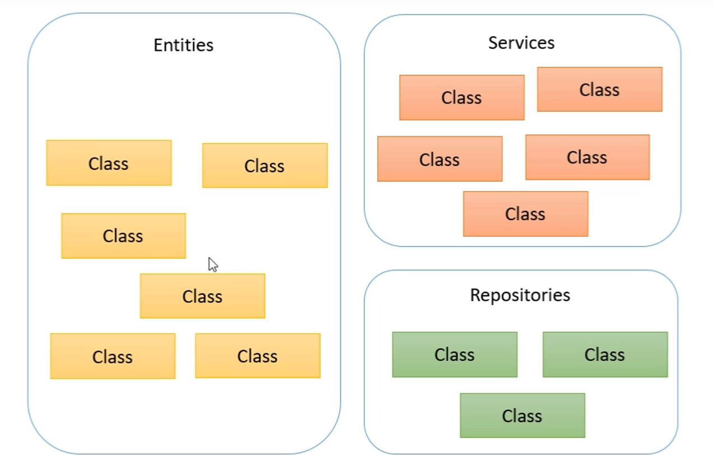
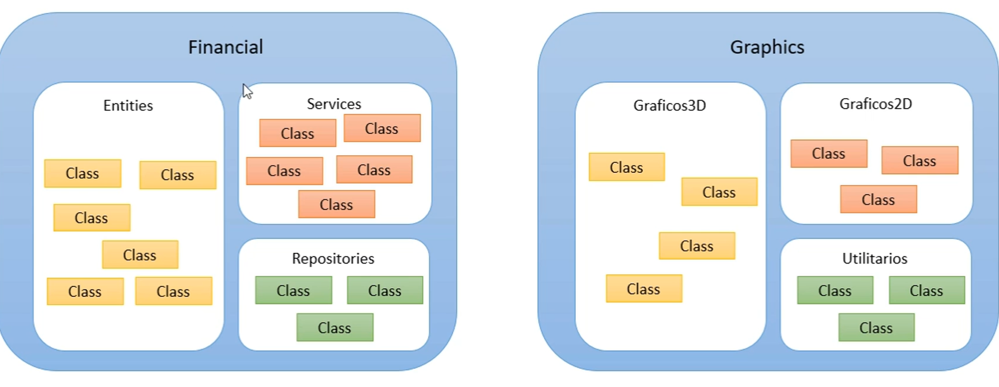
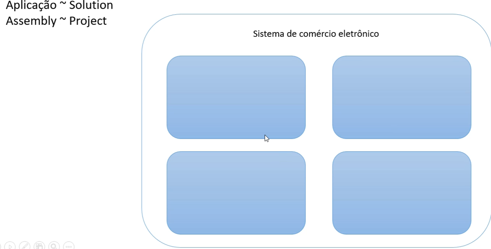

# Estrutura de uma aplicação/programa em C#

Namespace = Agrupamento lógico de classes relacionadas




Assembly(DLL ou EXE) = Agrupamento físico de classes relacionadas(build)






# Checklist

**Estrutura de arquivos**
 - Arquivo .sln
 - Arquivo .csproj
 - Classe principal .cs
 - Subpastas obj e bin

**Program.cs**
 - Cláusulas using: referência a outros namespaces
 - Namespace
 - Classe
 - Método
 - static void Main(string[] args)


# Tipos de Dados em C# e Unicode

## 1. Tipos de Dados em C#

C# é uma linguagem fortemente tipada, o que significa que cada variável precisa ter um tipo definido. Aqui estão os principais tipos de dados:

### Tipos Numéricos Inteiros

- **`int`**: Um inteiro de 32 bits. Intervalo: `-2,147,483,648` a `2,147,483,647`.
```csharp
int idade = 25;
```

**long**: Um inteiro de 64 bits. Intervalo: -9,223,372,036,854,775,808 a 9,223,372,036,854,775,807.

```csharp
long populacaoMundial = 7800000000L;
```


**short**: Um inteiro de 16 bits. Intervalo: -32,768 a 32,767.
```csharp
short temperatura = -10;
```

**byte**: Um número inteiro de 8 bits sem sinal. Intervalo: 0 a 255.

```csharp
byte idade = 120;
```


## Tipos Numéricos com Ponto Flutuante

**float**: Um número de ponto flutuante de 32 bits. Precisa do sufixo f para ser reconhecido.
```csharp
float altura = 1.75f;
```

**double**: Um número de ponto flutuante de 64 bits. É o tipo padrão para valores com casas decimais.

```csharp
double preco = 19.99;
```

**decimal**: Um número decimal de alta precisão, usado frequentemente para valores monetários. Usa o sufixo m.

```csharp
decimal salario = 19999.99m;
```

# Tipos Lógicos

**bool**: Armazena true ou false
```csharp
bool estaChovendo = true;
```

# Tipos de Caractere e Cadeia de Caracteres

**char**: Armazena um único caractere Unicode. Usa aspas simples.
```csharp
char letra = 'A';
```

**string**: Armazena uma sequência de caracteres Unicode.
```csharp
string nome = "Thomas Shelby";
```