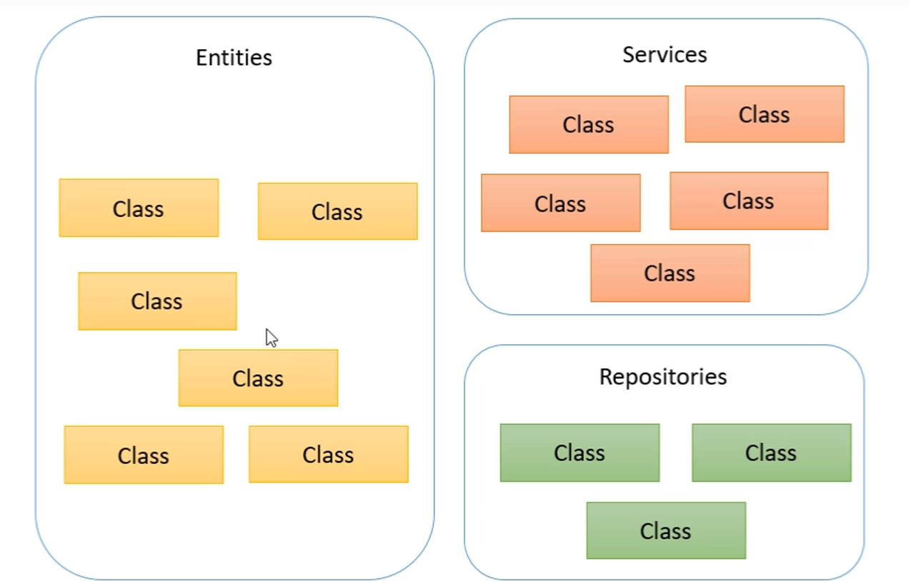
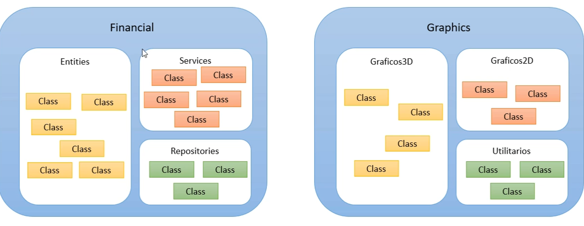
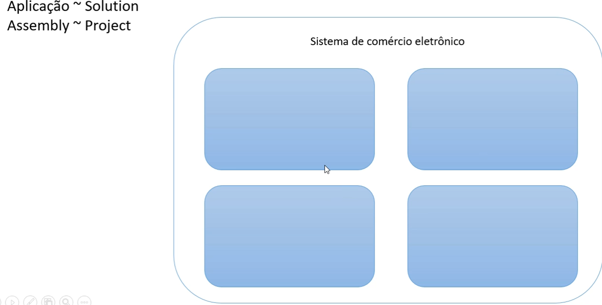

# Estrutura de uma aplicação/programa em C#

Namespace = Agrupamento lógico de classes relacionadas




Assembly(DLL ou EXE) = Agrupamento físico de classes relacionadas(build)






# Checklist

**Estrutura de arquivos**
 - Arquivo .sln
 - Arquivo .csproj
 - Classe principal .cs
 - Subpastas obj e bin

**Program.cs**
 - Cláusulas using: referência a outros namespaces
 - Namespace
 - Classe
 - Método
 - static void Main(string[] args)


# Tipos de Dados em C# e Unicode

## 1. Tipos de Dados em C#

C# é uma linguagem fortemente tipada, o que significa que cada variável precisa ter um tipo definido. Aqui estão os principais tipos de dados:

### Tipos Numéricos Inteiros

- **`int`**: Um inteiro de 32 bits. Intervalo: `-2,147,483,648` a `2,147,483,647`.
```csharp
int idade = 25;
```

**long**: Um inteiro de 64 bits. Intervalo: -9,223,372,036,854,775,808 a 9,223,372,036,854,775,807.

```csharp
long populacaoMundial = 7800000000L;
```


**short**: Um inteiro de 16 bits. Intervalo: -32,768 a 32,767.
```csharp
short temperatura = -10;
```

**byte**: Um número inteiro de 8 bits sem sinal. Intervalo: 0 a 255.

```csharp
byte idade = 120;
```


## Tipos Numéricos com Ponto Flutuante

**float**: Um número de ponto flutuante de 32 bits. Precisa do sufixo f para ser reconhecido.
```csharp
float altura = 1.75f;
```

**double**: Um número de ponto flutuante de 64 bits. É o tipo padrão para valores com casas decimais.

```csharp
double preco = 19.99;
```

**decimal**: Um número decimal de alta precisão, usado frequentemente para valores monetários. Usa o sufixo m.

```csharp
decimal salario = 19999.99m;
```

# Tipos Lógicos

**bool**: Armazena true ou false
```csharp
bool estaChovendo = true;
```

# Tipos de Caractere e Cadeia de Caracteres

**char**: Armazena um único caractere Unicode. Usa aspas simples.
```csharp
char letra = 'A';
```

**string**: Armazena uma sequência de caracteres Unicode.
```csharp
string nome = "Thomas Shelby";
```


# Polimorfismo em C\#

O **polimorfismo** é um dos pilares fundamentais da programação orientada a objetos (POO). Ele permite que objetos de diferentes classes sejam tratados de maneira uniforme através de uma interface comum, proporcionando flexibilidade e extensibilidade ao código. A palavra "polimorfismo" significa "muitas formas", e, na prática, refere-se à capacidade de um método ou função se comportar de maneiras diferentes dependendo do objeto que o está invocando.

## Tipos de Polimorfismo

### 1. Polimorfismo de Sobrecarga (Compile-time Polymorphism)

Esse tipo de polimorfismo ocorre em tempo de compilação e é obtido por meio de:
- **Sobrecarga de métodos (method overloading)**: quando dois ou mais métodos na mesma classe têm o mesmo nome, mas parâmetros diferentes (tipo ou número de parâmetros).
- **Sobrecarga de operadores**: onde operadores são redefinidos para trabalhar com tipos de dados definidos pelo usuário.

#### Exemplo de **sobrecarga de método**:

```csharp
public class Calculadora
{
    // Método somar com dois inteiros
    public int Somar(int a, int b)
    {
        return a + b;
    }

    // Método somar com três inteiros (mesmo nome, mas parâmetros diferentes)
    public int Somar(int a, int b, int c)
    {
        return a + b + c;
    }
}
```

Nesse exemplo, o método `Somar` tem diferentes formas de comportamento dependendo dos parâmetros passados.

### 2. Polimorfismo de Substituição (Runtime Polymorphism)

Esse tipo de polimorfismo ocorre em tempo de execução e é geralmente implementado usando **herança** e **sobrescrita de métodos** (`override`). Aqui, uma classe base define um método virtual que pode ser sobrescrito por suas classes derivadas, permitindo que o mesmo método tenha diferentes implementações dependendo da instância da classe.

Esse tipo de polimorfismo é alcançado via:
- **Métodos virtuais (`virtual` e `override`)**.
- **Interfaces**, onde diferentes classes podem implementar os mesmos métodos definidos em uma interface.

#### Exemplo de **polimorfismo em tempo de execução**:

```csharp
public class Animal
{
    public virtual void EmitirSom()
    {
        Console.WriteLine("Som de animal.");
    }
}

public class Cachorro : Animal
{
    public override void EmitirSom()
    {
        Console.WriteLine("Latido");
    }
}

public class Gato : Animal
{
    public override void EmitirSom()
    {
        Console.WriteLine("Miau");
    }
}

public class Program
{
    static void Main()
    {
        Animal meuAnimal1 = new Cachorro();
        Animal meuAnimal2 = new Gato();

        // Polimorfismo: Chamada ao mesmo método EmitirSom() resulta em diferentes comportamentos
        meuAnimal1.EmitirSom(); // Latido
        meuAnimal2.EmitirSom(); // Miau
    }
}
```

## Explicação:

- Neste exemplo, a classe base **`Animal`** tem o método virtual **`EmitirSom`**. As classes derivadas, **`Cachorro`** e **`Gato`**, sobrescrevem esse método, fornecendo sua própria implementação.
- Quando o método `EmitirSom` é chamado, o compilador e o tempo de execução decidem qual implementação será usada com base no tipo do objeto que está invocando o método.

## Benefícios do Polimorfismo

- **Flexibilidade e Extensibilidade**: O polimorfismo permite que você adicione novas classes derivadas sem alterar o código existente que trabalha com a classe base.
- **Redução de Código Duplicado**: O comportamento comum é definido na classe base, e as diferenças específicas são implementadas nas classes derivadas.
- **Manutenção Facilitada**: Alterações no comportamento de um método podem ser feitas na classe derivada, sem a necessidade de alterar todas as partes do código que usam a classe base.

## Resumo

O polimorfismo permite que diferentes tipos de objetos sejam tratados através de uma interface comum, proporcionando diferentes comportamentos para o mesmo método, dependendo do objeto que o chama. Isso é essencial para a construção de sistemas extensíveis, flexíveis e de fácil manutenção.

---

**Referências adicionais:**
- Documentação oficial do C\# sobre [polimorfismo](https://learn.microsoft.com/en-us/dotnet/csharp/programming-guide/classes-and-structs/polymorphism).


# Diferença entre Struct e Classe em C#

Em C# e Go, as structs e classes são usadas para criar tipos compostos, mas elas têm diferenças fundamentais em termos de comportamento, memória e uso. Vamos explorar cada linguagem separadamente.

## 1. Diferença entre Struct e Classe em C#

### **Struct (Estrutura)**
- **Tipo de Valor**: Structs são tipos de valor, o que significa que elas são armazenadas diretamente na pilha de memória (stack). Quando você atribui uma struct a outra variável, é feita uma cópia completa dos dados.
- **Desempenho**: Como são alocadas na pilha, structs podem ser mais rápidas para criar e acessar, especialmente para tipos pequenos e de vida curta. No entanto, usar structs grandes pode prejudicar o desempenho devido à cópia de dados.
- **Sem Herança**: Structs não suportam herança (exceto herdar implicitamente de `System.ValueType`). Isso significa que você não pode criar hierarquias de structs como faz com classes.
- **Imutabilidade Recomendável**: Structs geralmente são usadas para representar valores imutáveis e pequenos (por exemplo, `DateTime`, `Point`, `Color`). Alterar um campo de uma struct resulta na criação de uma nova instância.
- **Construtores e Métodos**: Structs podem ter métodos e construtores, mas não podem ter um construtor sem parâmetros explicitamente definido. Além disso, não suportam destrutores.

### **Classe**
- **Tipo de Referência**: Classes são tipos de referência, o que significa que são armazenadas no heap. Quando você atribui uma instância de classe a outra variável, apenas a referência é copiada, não os dados reais.
- **Desempenho**: Alocação no heap pode ser mais lenta, e o coletor de lixo (Garbage Collector) gerencia a memória das instâncias de classe. Isso significa que classes são mais eficientes quando lidamos com grandes volumes de dados que precisam ser manipulados e compartilhados sem cópia.
- **Suporte a Herança**: Classes suportam herança, permitindo criar hierarquias e relações complexas entre classes.
- **Imutabilidade Opcional**: Por padrão, classes são mutáveis, mas podem ser projetadas para serem imutáveis se necessário.
- **Construtores e Destrutores**: Classes podem ter construtores personalizados e destrutores para liberar recursos.

### **Exemplo de Uso**
```csharp
// Struct em C#
public struct Point
{
    public int X { get; set; }
    public int Y { get; set; }

    public Point(int x, int y)
    {
        X = x;
        Y = y;
    }
}

// Classe em C#
public class Person
{
    public string Name { get; set; }
    public int Age { get; set; }

    public Person(string name, int age)
    {
        Name = name;
        Age = age;
    }
}
```